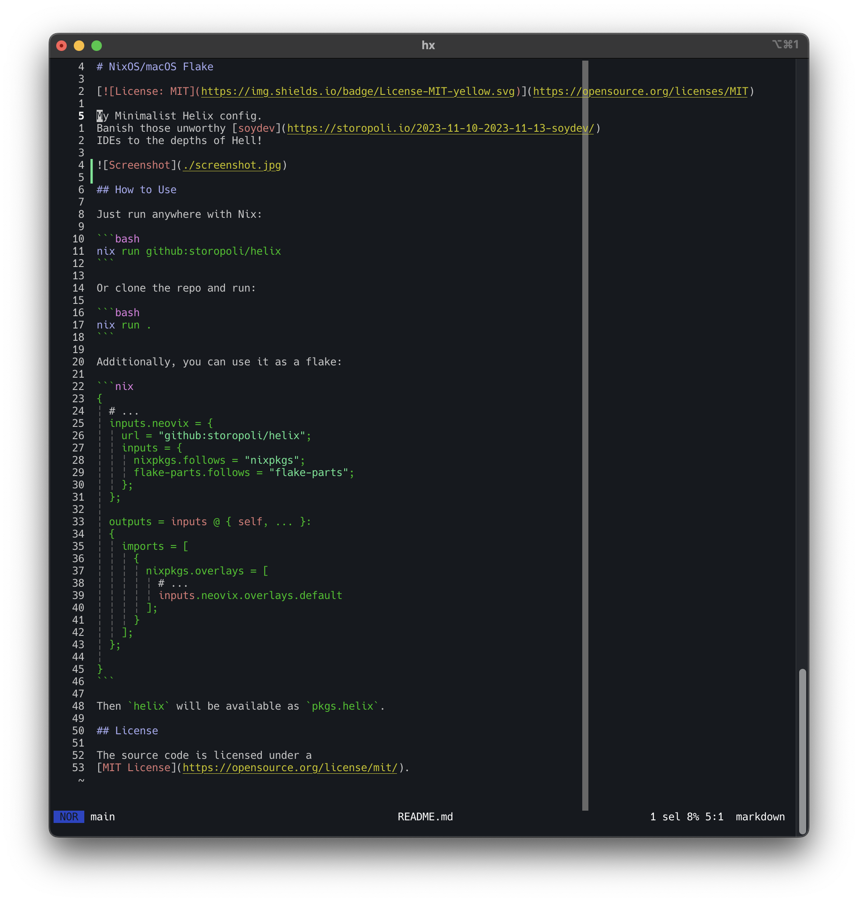

# NixOS/macOS Flake

[](https://opensource.org/licenses/MIT)

My Minimalist Helix config.
Banish those unworthy [soydev](https://storopoli.io/2023-11-10-2023-11-13-soydev/)
IDEs to the depths of Hell!



## How to Use

Just run anywhere with Nix:

```bash
nix run github:storopoli/helix
```

Or clone the repo and run:

```bash
nix run .
```

Additionally, you can use it as a flake:

```nix
{
  # ...
  inputs.neovix = {
    url = "github:storopoli/helix";
    inputs = {
      nixpkgs.follows = "nixpkgs";
      flake-parts.follows = "flake-parts";
    };
  };

  outputs = inputs @ { self, ... }:
  {
    imports = [
      {
        nixpkgs.overlays = [
          # ...
          inputs.neovix.overlays.default
        ];
      }
    ];
  };

}
```

Then `helix` will be available as `pkgs.helix`.

## License

The source code is licensed under a
[MIT License](https://opensource.org/license/mit/).
